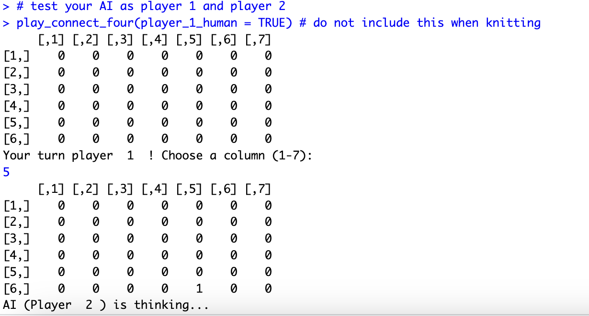

Overview:
This project implements an adversarial game-playing agent for Connect 4 using a depth-limited minimax search with alpha-beta pruning. The agent evaluates board states and selects moves that maximize win probability while preventing opponent threats.

Key Components:
- Game state representation and legal move generation
- Heuristic board evaluation (win/block/double-threat detection)
- Minimax decision search with alpha-beta pruning optimization
- Turn-based simulation for agent vs. human gameplay

Requirements:
R
rmarkdown

How to Run
In R Studio: 
- install.packages("rmarkdown")

- rmarkdown::render("connect_4_R_Script.Rmd")

##Sample Screenshot:

